#### 时间常数分析法

**时间常数**τ：电路中每一个结点所对应的电容及与之并联的电阻的乘积

**开路时间常数法**：适用于-3dB高频带宽，计算每一个开路时间常数$\tau_{oi}=R_{oi}C_i$
*   画出等效电路
*   逐个求解从各电容两端看的等效电阻
*   求解时将电路中其它起高频带宽限制作用的电容进行**开路**处理，并将独立信号源设为无效
*   求解每个电容的开路时间常数及对应的**上限截止频率**$f_{Hi}$
*   写出高频段电压放大倍数的传递函数$A_u(s)=A_{uM}\prod\frac{1}{1+jf/f_{Hi}}$

**短路时间常数分析法**适用于-3dB低频带宽，计算每一个开路时间常数$\tau_{oi}=R_{oi}C_i$
*   画出等效电路
*   逐个求解从各电容两端看的等效电阻
*   求解时将电路中其它起高频带宽限制作用的电容进行**短路**处理，并将独立信号源设为无效
*   求解每个电容的开路时间常数及对应的**下限截止频率**$f_{Hi}$
*   写出低频段电压放大倍数的传递函数$A_u(s)=A_{uM}\prod\frac{1}{1+jf/f_{Li}}$

放大电路总的传递函数：$A_u(s)=A_{uM}\cdot\prod\frac{1}{1+jf/f_{Hi}}\cdot\prod\frac{1}{1+jf/f_{Li}}$

### 4-9 放大电路的频率特性

**典型频率特性曲线**
*	$\dot{A_{usM}}$中频放大倍数
*	$f_L$：下限截止频率
*	$f_H$：上限截止频率
*	Δf：通频带（BW）

常用波特图分析。特点：
*	折线化
*	对数分度
*	乘法变加法

#### 频率失真

**分类**：
*	幅频失真
*	相频失真
*	组合失真

**产生原因**：
*	电抗性元件
*	β

#### 三极管的高频参数

混合π型高频小信号模型

**等效模型**

**参数计算**
-	$g_m=\frac{\beta}{r_{b'e}}$

**单向化**

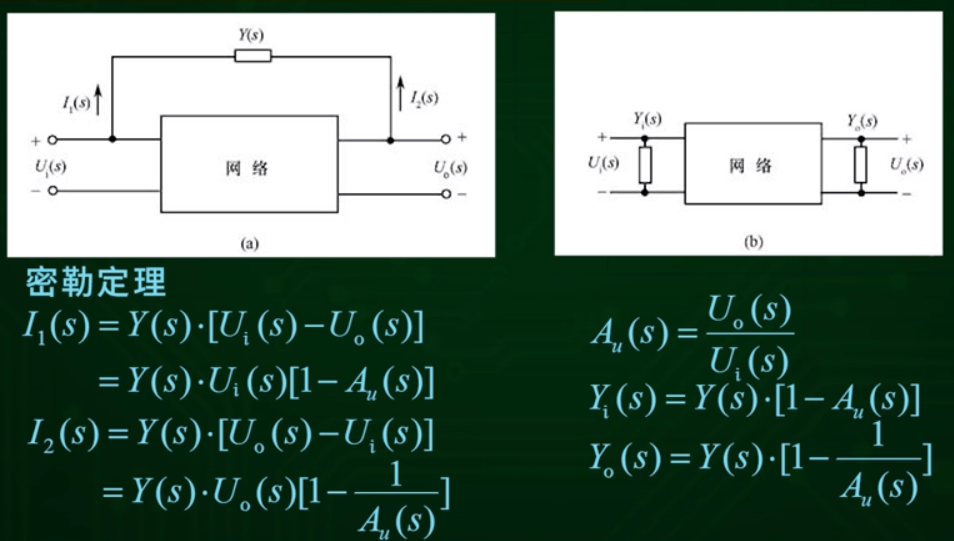

#### 电流放大系数β的频率响应

*	**共射截止频率**$f_\beta=\frac{1}{2\pi{r_{b'e}}(C_{b'e}+C_{b'c})}$
*	**特征频率**$f_T\approx\beta_0f_\beta$

#### 理想运放的技术指标

**开环差模增益**：$A_{od}=\infty$

**差模输入电阻**：$r_{id}=\infty$

**输出电阻**：$r_o=0$

**共模抑制比**：$K_{CMR}=\infty$

一般在原理性分析时，运算放大器都可视作理想的。

#### 在线性区工作时：
*   **虚短**：==$u_o=A_{od}(u_+-u_-)$==，线性工作区域下可以把输入端看作等电位
*   **虚断**：输入电阻趋近无穷，$i_+=i_-=0$，线性状态下可把两输入端看作开路。

#### 在非线性区工作时：
*   $u_+>u_-时，u_o=+U_{OPP}$
*   $u_+<u_-时，u_o=-U_{OPP}$
*   **虚短**不存在，**虚断**仍存在。

#### 放大电路的模型

是一个双端口网络

对输入端，可等效为*输入电阻*

对输出端，可等效为*受控电压源*或*受控电流源*

**电压放大模型**：
*   $A_{vo}$：负载开路时的电压增益
*   $R_i$：输入电阻
*   $R_o$：输出电阻
*   $V_o=A_{vo}v_i\frac{R_L}{R_o+R_L}$
*   $A_v=\frac{v_o}{v_i}=A_{vo}\frac{R_L}{R_o+R_L}$
*   主要由负载影响增益
*   输出电阻越小越好

**电流放大模型**：
*   $A_{is}$：负载短路时的电流增益
*   $i_o=A_{is}i_i\frac{R_o}{R_o+R_L}$
*   $A_i=\frac{i_o}{i_i}=A_{is}\frac{R_o}{R_o+R_L}$
*   主要由负载影响增益
*   输入电阻越小越好

#### 主要技术指标

**放大倍数**：
*   电压放大倍数$\dot{A_u}=\frac{\dot{U_o}}{\dot{U_i}}$
*   源电压放大倍数$\dot{A_{us}}=\frac{\dot{U_o}}{\dot{U_s}}$
*   电流放大倍数$\dot{A_i}=\frac{\dot{I_o}}{\dot{I_i}}$
*   源电流放大倍数$\dot{A_{is}}=\frac{\dot{I_o}}{\dot{I_s}}$
*   功率放大倍数$A_{P}=\frac{P_o}{P_i}$
*   输入电阻$R_i$
*   输出电阻$R_o$：负载开路时在输出端加电压源
*   通频带BW：放大倍数不小于中频电压放大倍数$A_0$的$1/\sqrt{2}$时对应的频率范围

### 4-2 放大电路的分析方法

#### 分析要求

放大电路建立正确的静态，是保证动态工作的前提

放大电路的分析主要指直流特性与交流特性的分析，须区分静态与动态，直流通路与交流通路

*   **静态**：$-\mu_i=0$，又称直流工作状态
*   **动态**：$-\mu_i\neq0$，又称交流工作状态

*   **直流通路**：直流量传递的途径，耦合电容开路
*   **交流通路**：交流量传递的途径，直流电源和耦合电容短路

#### 静态分析

**分析对象**：静态工作点Q：$I_{BQ},I_{CQ},U_{CWQ}$以及$U_{GSQ},I_{DQ},U_{DSQ}$

**分析路径**：直流通路

**分析方法**：
*   **计算法**：画出放大电路的直流通路，以两个固定电位间的通路为着眼点，根据KVL、KCL列方程
*   **图解分析法**：
    *   双极型：在输入特性曲线上画出静态工作点，得到$I_{BQ},U_{BEQ}$，在输出特性曲线上画出静态工作点，得到$I_{CQ},U_{CEQ}$
    *   场效应管：在转移特性曲线上画出静态工作点，得到$I_{DQ},U_{GSQ}$，在输出特性曲线上画出静态工作点，得到$I_{CQ},U_{CEQ}$

#### 动态分析

**分析对象**：$A_u,R_i,R_o$

**分析路径**：交流通路

**分析方法**：
*   图解分析法：
    *   画出交流通路
    *   列出输出回路交流方程
    *   在输出特性曲线中画出负载线：过Q且斜率为$-\frac{1}{R'_L}$的直线
*   微变等效电路法：微变使得近似线性
    1.  画出交流通路
    2.  将三极管用等效模型代替
    3.  整理出放大电路的等效电路
    4.  基于KCL、KVL列方程

**结论**：
*   交流负载线与直流负载线交于Q
*   直流负载线反映静态时电压电流变化关系，用于确定Q
*   交流负载线反映动态时电压电流变化关系，是交流输入下Q的运动轨迹
*   交流负载电阻$R'_L:\frac{1}{R'_L}=\frac{1}{R_L}+\frac{1}{R_c}$，故交流负载线更陡

### 4-3 共射放大电路

#### 共发射极组态放大电路的组成

**三极管VT**：放大作用

**负载电阻**$R_C,R_L$：将变化的电流转化为电压输出

**偏置电路**$V_{CC},R_B,R_C$：提供直流偏置

**耦合电容**$C_1,C_2$：隔直流，通交流

**放大电路的构成原则**：
*   与放大管种类匹配的电源极性
*   合理设置静态工作点Q
*   外加输入信号加在发射结上
*   将交流量转换成电压，输出端须接负载电阻$R_C$

#### 静态分析

**直流负载线的确定方法**：
1.  $u_{CE}=V_{CC}-i_CR_C$
2.  在输出特性曲线上确定两点$V_{CC},V_{CC}/R_C$
3.  $u_{BE}=V_{CC}-i_BR_b$
4.  在输入特性曲线上作出输入负载线，两线交点即为Q

#### 动态分析

**交流负载线的确定方法**：
1.  通过输出特性曲线上的Q点作一条斜率为$-1/R'_L$直线
2.  两个特殊点$(0,\frac{V_{CE}}{R'_L}+I_C),(V_{CE}+I_CR'_L,0)$

**饱和失真**：放大电路工作到三极管的饱和区引起的非线性失真
*   NPN管：输出电压表现为底部失真

**截止失真**：放大电路工作到三极管的截止区引起的非线性失真
*   NPN管：输出电压表现为顶部失真

**放大电路的最大不失真输出幅度**：工作点Q要设置在输出特性曲线放大区的中间部位

**电压放大倍数**：$\dot{A_u}=\frac{\dot{U_o}}{\dot{U_i}}=\frac{\beta{R'_L}}{r_{be}}$

**输入电阻**：$R_i=\frac{\dot{U_i}}{\dot{I_i}}=R_B//r_{be}\approx{r_{be}}$

**输出电阻**：$R_o=\frac{\dot{U_o}}{\dot{I_o}}|_{R_L=\infty,\dot{U_S}=0}=R_C$

**源电压放大倍数**：$\dot{A_{us}}=\frac{\dot{U_o}}{\dot{U_S}}=\dot{A_u}\frac{R_i}{R_i+r_S}$

### 4-4 放大电路的稳定偏置

**Q点对电路性能的影响**：$u_{BE},\beta,I_{CEO}$均为温度的函数

#### 分压式偏置电路

须有$I_{RB1}>>I_{BQ},U_B>>U_{BEQ}$

**直流分析**：
*   $U_B=V_{CC}R_{B2}/(R_{B1}+R_{B2})$
*   $I_{BQ}=I_{CQ}/\beta$
*   $I_{CQ}=I_{EQ}=(U_B-U_{BEQ})/R_E$
*   $U_{CEQ}=V_{CC}-I_{CQ}(R_C+R_E)$

**交流分析**：
*   **电压放大倍数**：$\dot{A_u}=-\frac{\beta\cdot{R'_L}}{r_{be}+(1+\beta)R_E}$
*   **输入电阻**：$[r_{be}+(1+\beta)R_E]//R'_B$
*   **输出电阻**：忽略$r_{ce}$的影响：$R_o\approx{R_C}$

### 4-5 共基及共集电极放大电路

#### 共基组态基本放大电路

**直流分析**：与共射放大电路一致

**交流分析**
*   **电压放大倍数**：$\dot{A_u}=u_o/u_i=\frac{\beta{R'L}}{r_{be}}$
*   **输入电阻**：$R_i=R_E//R'_i\approx\frac{r_{be}}{1+\beta}$
*   **输出电阻**：$R_o\approx{R_C}$

**特点**：
*   同相放大器
*   输入电阻比共射电路小
*   输出电阻与共射电路相同

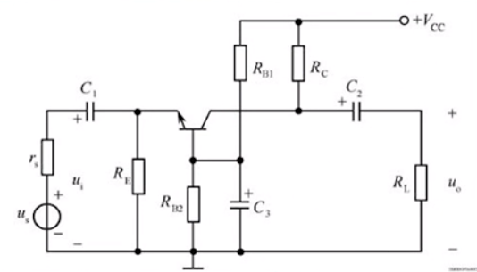

#### 共集电极放大电路

**电压放大倍数**：$\dot{A_u}=\frac{(1+\beta)R'_L}{r_{be}+(1+\beta)R'_L}\approx1$

**输入电阻**：$R_i=R_{B1}//R_{B2}//R'_i$

**输出电阻**：$R_o=R_E//\frac{r_{be}+r'_s}{1+\beta}$

**特点**：
1.  射极输出器=电压跟随器
2.  输入电阻高
3.  输出电阻低

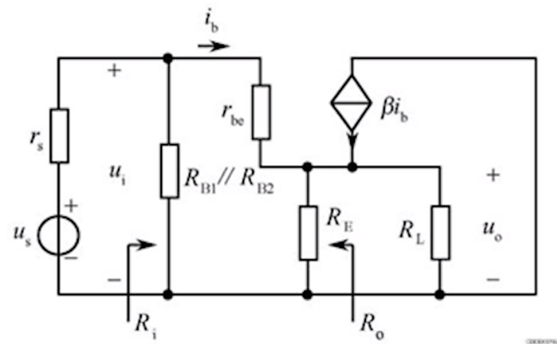

### 4-7 场效应管放大电路

**组态**：
*   共源：相当于共射极
*   共栅：相当于共基极
*   共漏：相当于共集电极

#### 共源组态放大电路

**静态分析**：
1.  **计算法**：
    *   $U_{GS}=U_G-U_S=-I_DR_S$
    *   $I_D=I_{DSS}(1-\frac{U_{GS}}{U_{GS(off)}})^2$
    *   $U_{DS}=V_{DD}-I_D(R_D+R_S)$
2.  **图解法**

**交流分析**：
*   **电压放大倍数**$\dot{A_u}=-g_mR'_L,R'_L=R_D//R_L,g_m=-\frac{2}{U_{GS(off)}}\sqrt{I_{DQ}I_{DSS}}$
*   **输入电阻**$R_i=R_g$
*   **输出电阻**$R_o=R_d$

#### 共漏组态放大电路

**静态分析**：
*   $U_G=\frac{R_{G2}}{R_{G1}+R_{G2}}V_{DD}$
*   $I_D=I_{DSS}(1-\frac{U_{GS}}{U_{GS(off)}})^2$
*   $U_{GS}=U_G-I_DR_S$

**交流分析**：
*   **电压放大倍数**$\dot{A_u}=\frac{G_mR'_L}{1+g_mR'_L},R'_L=R_S//R_L$
*   **输入电阻**$R_i=R_{G3}+(R_{G1}//R_{G2})$
*   **输出电阻**$R_o=R_S//r_{ds}//\frac{1}{g_m}\approx{R_S}//\frac{1}{g_m}$

动态性能比较表

##  1 运算放大器的线性应用

### 1-1 理想运放的特性

**共模信号**：两信号和的一半，即均值

**差模信号**：两信号差的一半

运放具有放大差模、抑制共模的特点

#### 理想运放的技术指标

**开环差模增益**：$A_{od}=\infty$

**差模输入电阻**：$r_{id}=\infty$

**输出电阻**：$r_o=0$

**共模抑制比**：$K_{CMR}=\infty$

一般在原理性分析时，运算放大器都可视作理想的。

#### 在线性区工作时：
*   **虚短**：==$u_o=A_{od}(u_+-u_-)$==，线性工作区域下可以把输入端看作等电位
*   **虚断**：输入电阻趋近无穷，$i_+=i_-=0$，线性状态下可把两输入端看作开路。

#### 在非线性区工作时：
*   $u_+>u_-时，u_o=+U_{OPP}$
*   $u_+<u_-时，u_o=-U_{OPP}$
*   **虚短**不存在，**虚断**仍存在。

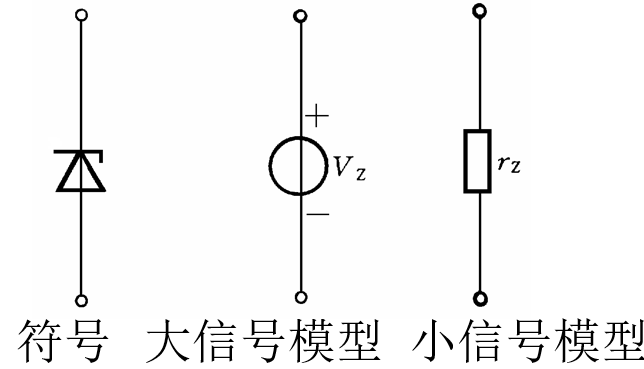

### 1-2 比例运算电路

#### 反相比例运算电路

深度负反馈

平衡电阻R'在运放足够理想时无效，在实际中有效，$\frac{1}{R'}=\frac{1}{R_1}+\frac{1}{R_F}$

$\frac{u_I-u_-}{R_1}=\frac{u_--u_o}{R_F}\Rightarrow{u_o}=-\frac{R_F}{R_1}u_I$

当$R_F=R_1$时，$u_o=-u_I$，是为倒相器

**虚地**：同相、反相端电位都为0

*   **优点**：由于共模信号为0，计算精度高；
*   **缺点**：反相端电阻即为$R_I$，输入电阻过小

#### 同相比例运算电路

${u_o}=(1+\frac{R_F}{R_1})u_I$

当$R_F=0，R_1=\infty$时，$u_o=u_I$，是为电压跟随器

*   **优点**：输入电阻无穷大（由此可完全获得信号）
*   **缺点**：不**虚地**

进行阻抗变换，起电压隔离的作用

### 1-3 加法和减法电路

#### 反相加法器

$u_o=-(\frac{u_1}{R_1}+\frac{u_2}{R_2}+\frac{u_3}{R_3})R_F$

**优点**：
*   要改变权值，只要改动对应支路
*   **虚地**，共模小

#### 同相加法器

${u_o}=(1+\frac{R_F}{R_1})u_+$

$u_+=(\frac{u_1}{R'_1}+\frac{u_2}{R'_2}+\frac{u_3}{R'_3})R_P$，其中$R_P=R'_1、R'_2、R'_3、R'并联$

**缺点**：
*   结果复杂
*   调试不便
*   不**虚地**

#### 加法器实现的减法器

$u_o=\frac{R_f}{R_2}u_{i2}-\frac{R_f}{R_1}u_{i1}$

#### 差动减法器

$u_{o1}=-\frac{R_f}{R_1}u_{i1}$

$u_{o2}=(1+\frac{R_f}{R_1})\frac{R'}{R'+R_2}u_{i2}$

当$\frac{R_f}{R_1}=\frac{R'}{R_2}$时，$u_o=\frac{R_f}{R_1}(u_{i2}-u_{i1})$

**缺点**：
*   不**虚地**
*   共模大
*   要选*共模抑制比*大的运放

### 1-4 积分、微分、指数、对数电路

#### 积分运算电路

$u_o=-\frac{1}{RC}\int{u_i}dt$

#### 微分运算电路

$u_o=-RC\frac{du_I}{dt}$

#### 对数运算电路

$u_o=U_Tln\frac{u_I}{RI_S}$，其中$i_D\approx{I_S}e^\frac{U_D}{U_T}$

通常用三极管解成二极管，以增大工作区域

#### 指数运算电路

$u_o=-RI_Se^\frac{U_D}{U_T}$

### 1-5 运放运算电路的应用

#### 数据放大器

**特点**：
*   高共模抑制比
*   高输入阻抗
*   高放大倍数

$u_o=\frac{R_4}{R_3}(1+\frac{2R_2}{R_1})(u_{S2}-u_{S1})$

$R_1$作用：调节增益

#### 电流-电压变换器

$u_o=-i_SR_f$

>   负载电阻不变时可视为电流放大电路

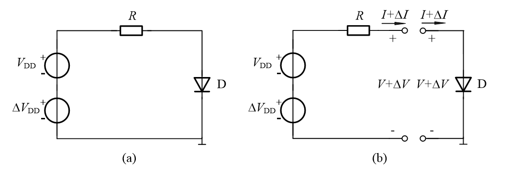

#### 电压-电流变换器

1.  负载不接地
$i_o=\frac{u_S}{R}$

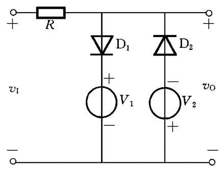

2.  负载接地
$i_o=-\frac{R_2}{R_1}\times\frac{u_S}{R_3+(\frac{R_3}{R_4}-\frac{R_2}{R_1})R_L}$，其中须避免分母为0。

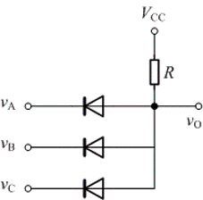

### 1-6 一阶有源滤波器

有源滤波器可以放大信号，负载要求低

**滤波器的技术指标**：
*   **通带增益**$A_{uf}$
*   **通带截止频率**$f_0$

$A_{uf}=1+\frac{R_F}{R_1}$

传递函数：$A(s)=\frac{A_{uf}}{1+\frac{s}{\omega_0}}$，其中$\omega_0=\frac{1}{RC}$

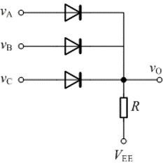

一阶低通

### 1-7 二阶有源滤波器

#### 二阶低通有源滤波器

$A_{uf}=1+\frac{R_F}{R_1}$

#### 二阶压控型低通有源滤波器

传递函数：$A_u(s)=\frac{A_{uf}}{1+(3-A_{uf})sCR+(sCR)^2}$

频率响应：$\dot{A_u}\frac{A_{uf}}{1-(\frac{f}{f_0})^2+j(3-A_{uf})\frac{f}{f_0}}$

#### 二阶压控型高通有源滤波器

$A_{uf}=1+\frac{R_F}{R_1}$

#### 二阶带通有源滤波器

#### 二阶带阻有源滤波器

并联一阶低通和一阶高通

##  2 运算放大器的非线性运用

### 2-1 电压比较器
**参考电压**$V_T$：使输出电压跳变时的输入电压，又称阈值/门限电压，输入电压小于参考电压时输出正的最大电压，反之则输出负的最大电压 

**特性**：非线性开关特性

普通的开环运放就能构成比较器：e.g.将一个输入端接地，即形成简单的过零电压比较器

对于*开环或正反馈运放*：
*   +端电位高，正饱和
*   -端电位高，负饱和

#### 基本比较器电路

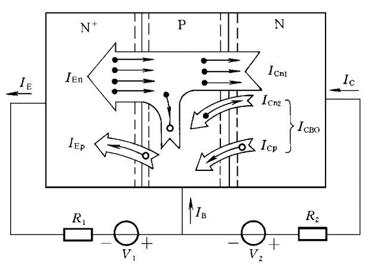

$VD_Z$：稳压管，用于限幅

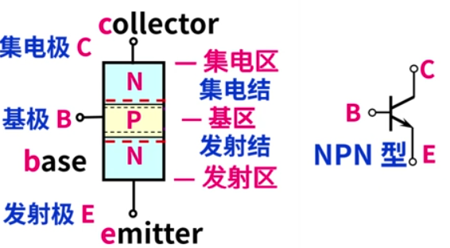

*   输出电压在$[-U_Z,U_Z]$之外时，稳压管被击穿，运放在线性区域工作
*   输出电压在$[-U_Z,U_Z]$之内时，稳压管不被击穿，运放在开环区域工作

### 2-2 集成电压比较器和窗口比较器

集成电压比较器往往能和运放互换：
*   运放作比较器时响应较慢
*   比较器作运放时由于不强调线性，信号较大时易失真

#### 集成电压比较器LM311

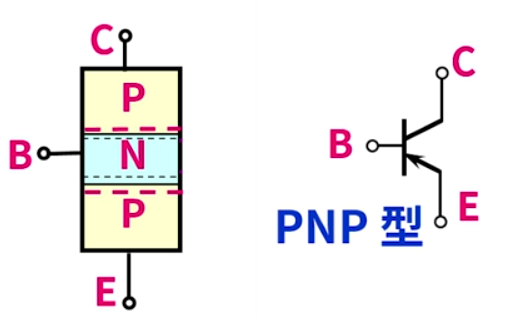

#### 窗口比较器

输入电压在$(U_L,U_H)$内时输出低电平，其它情况输出高电平

$U_L=\frac{R_2}{R_1+R_2}(V_{CC}-2U_D)$

两半导体用于隔离，以免输出电流过大或输出状态不确定

### 2-3 555定时器

由窗口比较器、RS触发器和三极管组成

|>|输入||>|输出|
|---|---|---|---|---|
|$\bar{R}$|TH|$\overline{TR}$|VT|Q|
|0|X|X|导通|0|
|1|$<\frac{2}{3}V_{CC}$|$<\frac{1}{3}V_{CC}$|截止|1|
|1|$>\frac{2}{3}V_{CC}$|$>\frac{1}{3}V_{CC}$|导通|0|
|1|$<\frac{2}{3}V_{CC}$|$>\frac{1}{3}V_{CC}$|不变|不变|

### 2-4 施密特触发器

**特点**：阈值电压有两个，即有回差

#### 用比较器构成

$u_o=U_Z$时：
*   上限阈值：$U_{T_+}=\frac{R_1}{R_1+R_2}U_Z$
*   下限阈值：$U_{T_-}=-\frac{R_1}{R_1+R_2}U_Z$

反相输入

同相输入

### 2-5 单稳态触发器

**应用**：控制、延时、整形

### 2-6 矩形波振荡电路

#### 用电压比较器构成：
1.  构成要点：
    *   比较器能实现翻转
    *   周期控制（RC控制电路）
2.  工作原理：
    *   非稳态电路
3.  参数：
    *   周期：$T=2R_TC_Tln(1+\frac{2R_1}{R_2})$
    *   占空比：50%

#### 占空比可调的矩形波振荡电路

#### 单电源矩形波振荡电路

$\begin{cases}u_o=V_{CC}时，U_+=\frac{2}{3}V_{CC}\\u_o=0时，U_-=\frac{1}{3}V_{CC}\end{cases}$

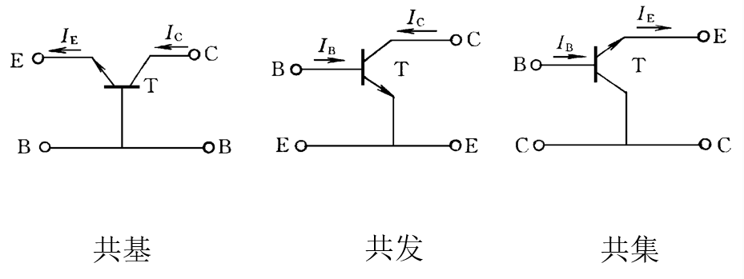

#### 555构成的振荡电路

占空比不是50%

$t_1=\frac{2}{3}(R_1+R_2)C，t_2=\frac{2}{3}R_2C，T=t_1+t_2$

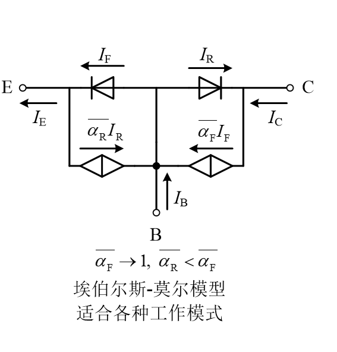

### 2-7 三角波振荡电路

由比较器和积分器组成

**参数分析**：
*   **幅度**：$2U_Z\frac{R_1}{R_2}$
*   **周期**：$\frac{4R_1R_4C}{R_2}$

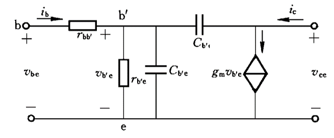